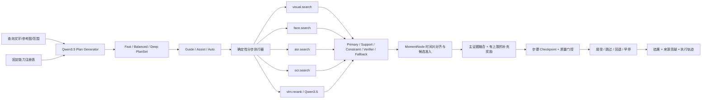

# Planner Lab：SnapMind 风格交互式检索实验

Planner Lab 是独立于现有 `/api/search` 的实验入口。它借鉴 SnapMind 的核心方法，但把论文中的图像检索工具替换为 MomentSeek 已有的视频视觉、人脸、ASR、OCR 与 Qwen3.5 多模态重排工具。旧的单计划 planner 不参与这里的决策，只复用经过验证的 OpenAI-compatible vLLM 连接层。

## 结构



关键边界：

- Qwen3.5 只选择注册工具、改写子查询和提出参数，不生成检索分数。
- `primary` 可以创建候选；`support` 只能增强已有候选；`constraint`、`verifier` 不得独立创建候选。
- `fallback` 仅在指定主步骤未通过质量门时执行；没有显式 fallback 且主候选为空时，第一个补充通道可被记录为应急升级。
- 每一步先在 checkpoint 上预执行，再根据结果数量、分数区分度、匹配率、候选存活数和 Top-K 扰动决定接受、跳过或回退。
- 补充证据奖励默认不超过主证据分数的 40%，避免辅助通道反客为主。
- 多条相同分数不再被 MinMax 全部映射为 1；平坦分布默认回退。
- 同一工具重复执行仍只算一个独立来源，避免 CombMNZ 制造虚假共识。
- `vlm.rerank` 是显式高成本工具，读取候选时间窗的多帧与已有证据，最多安排一次。
- 不同模态返回的时间粒度通过 `MomentNode` 对齐，并保留每个工具的 `raw_scores` 与 `source_contrib`。
- Guide/Assist 的“下一步”从相同输入确定性重放前 N 步，页面保留结果历史，可降权重跑、忽略最后一步或返回上次结果；Auto 连续执行并自动执行质量门控与稳定性早停。

## 服务器启用

vLLM 服务需要兼容 OpenAI `/v1/chat/completions`，并能接受 Qwen 多模态 `image_url` 输入。修改部署 `.env`：

```dotenv
PLANNER_LAB_ENABLED=true
ORCHESTRATION_ENABLED=true
QWEN35_VLLM_BASE_URL=http://你的-vllm-地址:18081/v1
QWEN35_PLANNER_MODEL=服务器实际模型名
QWEN35_RERANKER_MODEL=服务器实际模型名
```

如果 vLLM 在另一个容器中，地址应使用两个容器都能解析的服务名或内网 IP；不能在 MomentSeek 容器中用 `127.0.0.1` 指向宿主机服务。重启 MomentSeek 后，侧栏会出现 **Planner Lab**。页面右上状态显示“Qwen3.5 vLLM / 结构化规划与重排已配置”表示模型调用已开启；实际调用成功后，PlanSet 会标记“Qwen3.5 生成”。否则仍可用确定性的启发式三计划验证执行链路。

能力检查：

```bash
curl http://127.0.0.1:8000/api/planner-lab/capabilities
```

生成三套计划：

```bash
curl -X POST http://127.0.0.1:8000/api/planner-lab/plans \
  -F 'query_text=找到演讲者展示产品后观众鼓掌的片段' \
  -F 'mode=assist'
```

网页中可以选择 Fast、Balanced、Deep，编辑证据角色、启用状态、query、权重、Top-K、补充奖励上限、融合算法及步骤顺序，然后逐步或自动执行。完整审计记录会包含 `decision`、`decision_reason`、`effective_role` 与 `quality_metrics`，并写入 `runtime/orchestration-traces.jsonl`，类型为 `snapmind_planner_lab`。

## 第一轮实验

选取 30–50 个覆盖单模态、跨模态、时序和否定约束的查询，每个查询人工标注相关时间段。固定索引与素材，比较以下组别：

| 组别 | 规划 | Rerank | 用途 |
|---|---|---|---|
| A | Fast | 关闭 | 延迟基线 |
| B | Balanced | 关闭 | 多路融合收益 |
| C | Deep | 开启 | Qwen3.5 重排收益 |
| D | Assist 人工微调 | 可选 | 交互规划价值 |

至少记录 Recall@20、mAP@20、首个相关结果排名、时间段 IoU、端到端延迟、vLLM 调用次数、人工编辑次数与早停比例。重点做三项消融：去掉查询改写、把 RRF 换成 CombSUM、去掉稳定性早停。实验页返回的 `execution_id`、逐步 Top-K、Jaccard、rank stability 和来源贡献足以生成这份对比表。

## API

- `GET /api/planner-lab/capabilities`：固定工具、支持操作和模型状态。
- `POST /api/planner-lab/plans`：返回严格的 Fast/Balanced/Deep PlanSet；模型失败时按 fail-open 配置回退。
- `POST /api/planner-lab/execute`：执行用户确认或编辑后的单个计划；`max_steps` 支持逐步实验。

所有 Planner Lab 路由和 UI 都受 `PLANNER_LAB_ENABLED` 控制，不改变现有检索接口行为。

服务器已经存在经过验证的 Ascend 应用镜像时，可以使用
`docker/Dockerfile.planner-lab-overlay` 构建小型实验覆盖层。它保留基础镜像的
Python/NPU 依赖和编排 Profile，只替换应用代码、新 prompt 与前端静态文件。

在 Ascend 服务器上部署独立实验容器时使用 `scripts/deploy_ascend_planner_lab.sh`。
脚本要求显式提供 `BASE_IMAGE`，默认使用容器名
`momentseek-29154-snapmind-planner-lab`、端口 8010 和 NPU 2；它会保留旧容器作为备份，
健康检查或能力接口失败时自动恢复，不会修改正式 8000 容器。
