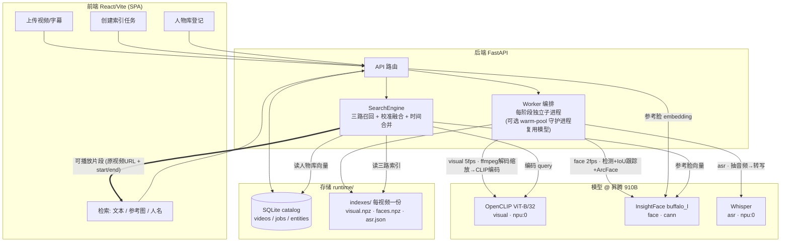

> Archived reference. Current documentation starts at `docs/README.md`.

# MomentSeek 检索 MVP — 方案设计 & 实验结果汇报

> **一句话**：输入"一段文字 / 一张参考图 / 一个人名"，在视频库里定位到**可直接播放的时间片段**。多模态三路索引 + 融合检索，已在昇腾 910B 跑通并完成一轮性能优化。
>
> 范围：MomentSeek 检索 MVP（不含视频擦除主线）。更细的工程交接见 `HANDOFF.md`，本文是精简汇报。

## 一、方案设计

**整体闭环**：`上传视频 → 建三路索引 → 查询 → 三路召回 → 按时间融合 → 返回可播放片段(原视频 URL + start/end)`

技术栈：FastAPI（后端）+ React/Vite（前端）+ SQLite（元数据）；索引以 npz/json 落盘在 `indexes/{video_id}/`。

*图：上传 → 三路索引 → 查询 → 校准融合 → 可播放片段 的整体数据流（含人物库登记支路）。*

**三路索引**

| 路 | 模型 | 解决的问题 | 抽帧 |
|----|------|-----------|------|
| Visual | OpenCLIP ViT-B/32 | 文本/图找场景、物体、视觉语义 | 5fps，5s 分段 |
| Face | InsightFace buffalo_l（SCRFD 检测 + ArcFace 识别，512d）| 参考图/人名找人 | 2fps + IoU 跟踪成 track |
| ASR | Whisper（带字幕则直接解析）| 文本找台词/语音内容 | 全程转写 |

**关键设计决策**（都是被实测逼出来的）

- **每阶段独立子进程**：模型用完即退、释放显存，共享卡上不长期占卡（后加可选 warm pool 守护进程做复用）。
- **Visual 不用固定 cosine 阈值**：CLIP 跨视频/查询的余弦分布差异大，改用**按本视频分布的 robust-z / 经验分位**判 strong/fuzzy。
- **融合打分校准到可比 [0,1]**：visual=经验分位、face=logistic 校准 cosine、asr=字面覆盖率；加权融合（face .55 / visual .30 / asr .15）。
- **片段按时间合并、限时长 ~15s**，避免"整段视频被召回"。

## 二、实验结果（昇腾 910B）

**1) 三路均在 NPU**：visual=`npu:0`、face=`cann`、asr=`npu:0`；常驻三模型显存 **~2.3GB**（65GB 卡无压力）。

**2) 分环节基准 + 1 小时外推**

- 模型加载 ~14.5s/job 固定成本；**Visual 瓶颈在 CPU**（解码 + 把帧 resize 到 224），NPU 编码几乎不耗时（~0.9ms/帧）。
- **1 小时串行 = 13–34 分钟**，两大变量：①**分辨率**（720p 比 360p 慢约 2×，因 CPU 预处理）②**语音密度**（ASR 转写跨视频差 5 倍）。

**3) 一轮性能优化**（已部署 + 实测，以真实 31min/1080p 综艺为基准：人脸 6308 检出/1583 track、对白 960 句）

| 优化 | 效果 | 等价性验证 |
|------|------|-----------|
| cv2.resize 替 PIL 预处理 | 预处理 **−36~42%** | 嵌入 cosine 0.996 |
| warm pool（模型常驻 + 空闲释放）| 重复 visual 29.6→7.9s（**−73%**）| 日志坐实模型复用 |
| ffmpeg 解码即缩放（多线程）| visual −37% / face −33% / **总 790→597s（−24%）** | visual cosine 0.99、人脸检出一致 |

→ 当前版本 1 小时 1080p 高密度**外推 ~19 分钟**（优化前 ~25min）。

**4) 一个被证伪的尝试（有价值的负结果）**：试过"一次解码同时喂 visual+face"省一遍解码，结果**反而慢 43%**——CLIP(torch_npu) 与 InsightFace(onnxruntime-CANN) 在一个进程里逐帧交错**同卡互抢**。已回滚，反过来坐实"每阶段独立子进程"还隔离了两个 NPU 运行时。

**5) 冷启动开销**：每 job 冷启动固定多耗 **~25.6s**（visual +21.9s 是 CLIP 首次 kernel 编译大头 / face +1.6 / asr +2.1）→ warm pool 对"批量短视频"收益最大。

## 三、现状 & 已知局限

- ✅ **闭环可用**：上传 → 三路索引 → 查询 → 可播放片段；前端展示各阶段耗时。
- ⚠️ **ASR 是当前最大瓶颈**（转写重，1h 约 8–9min），且是**字面检索(Ctrl+F)非语义**——台词识别错或换个说法就漏。
- ⚠️ **人脸**：单张参考图、只取最大脸，多角度覆盖有限（已规划"免费午餐"提精度方向，暂未实现）。
- ⚠️ 大视频经 cloudflare 前端传不上去（~100MB 上限）；公网 tunnel 无鉴权。

## 四、下一步（按优先级）

1. **ASR 提速**：分段并行 / 验证 FunASR-Paraformer 昇腾可行性 —— 最大瓶颈。
2. **ASR 语义检索**：文本 embedding 融合 lexical —— 解决字面漏检。
3. **人脸精度免费午餐**：多参考图质心 + TTA + 质量选脸（零重建索引）。
4. **搭小评测集**量化检索准确率（目前无量化）。
5. 大视频上传修复 + 最小鉴权。
